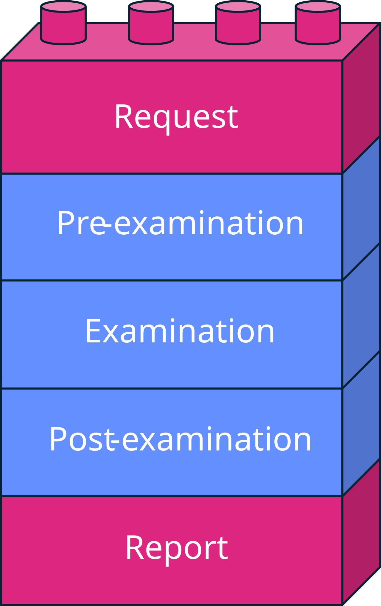
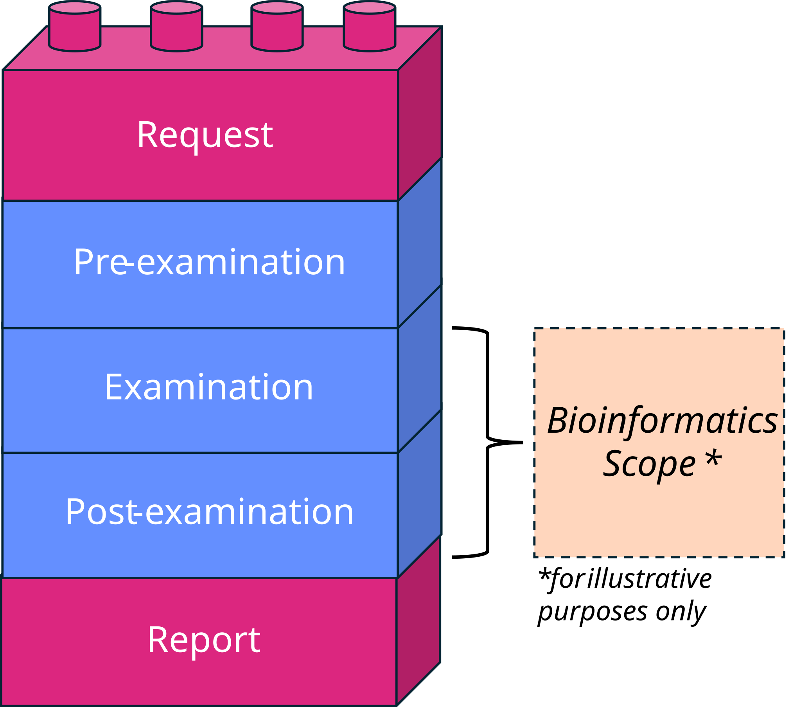

===============================================
Sample Journey
===============================================

Before designing internal audits for bioinformatics processes, it might be useful to map out the *sample journey*: the path a sample takes from initial input to final output. Doing this means thinking about how your own bioinformatics processes work, which then becomes the basis for choosing suitable :doc:`audit types <audit_introduction>`, and creating your :doc:`audit schedule <schedule>` and :doc:`checklist(s) <checklist>`. This helps identify risks and gaps in your bioinformatics processes, and determine how the frequency based on risk level. 

If you already audit wet laboratory processes, you may be familiar with the pre-examination, examination, and post-examination framework in ISO 15189 (Fig. 1). That framework describes the whole examination process as a sample journey, from request to report. In bioinformatics, however, your scope and responsibility within that examination process may only cover part of it (Fig. 2). So, the more useful questions to ask are: **where does your bioinformatics team's scope and responsibility begins and ends within that examination process, and where are the risks?** 

   *Figure 1:* Overview of the sample journey, i.e. the pre-examination, examination, and post-examination stages, from request to report.

   
   *Figure 2:* Example of a bioinformatics sample journey, showing the scope of bioinformatics processes and how they may fit into the overall examination process. 

Examples of mapping the sample journey to bioinformatics processes
-------------------------------------------------------------------
 a go at mapping the sample journey for your own bioinformatics processes.

Once you have mapped out these journeys, match the key steps to the appropriate audit type (vertical, horizontal, or cross-audit). Doing this ensures all critical areas are covered, reveals where risks or gaps hide, and helps you determine how often each step needs to be audited based on its risk level.

.. dropdown:: 🧪 Laboratory Procedure

   Map the laboratory procedure for processing samples from initial receipt to final reporting. This could include identifying risks at the pre-examination, examination, and post-examination stages. 

.. dropdown:: 🧬 Bioinformatics QC Procedure

   Map the bioinformatics quality control procedures for processing samples from raw input to final output. This could include quality scores, read trimming, 

.. dropdown:: 🧬 Bioinformatics Analysis Pipeline

   Map the bioinformatics analysis pipeline(s) for processing samples from raw input to final input. This could include identifying risks at each stage of the pipeline, such as assembly, variant calling, annotation, phylogenetic analysis, and reporting. 

   You may identify that you have some pipelines that are more critical than others, and therefore require more frequent audits. For example, a pipeline that is used for clinical decision-making may require more frequent audits than a pipeline used for research purposes.

.. dropdown:: 🌌 Galaxy Workflows

   Map the Galaxy workflows for processing samples from raw input to final output. This could include identifying risks at each stage of the workflow, such as data import, quality control, analysis, and reporting.

.. dropdown:: 💻 Code Update & Review Procedure

   Map the code update and review procedures for processing samples from raw input to final output. This could include identifying risks at each stage of the code update and review process, such as version control, code review, testing, and deployment.

.. dropdown:: 🔧 Systems, Hardware, and Databases

   Map the systems, hardware, and databases used for processing samples from raw input to final output. This could include identifying risks at each stage of the process, such as data storage, backup, and recovery, as well as database management, versioning, and security.

----------------

.. raw:: html

   