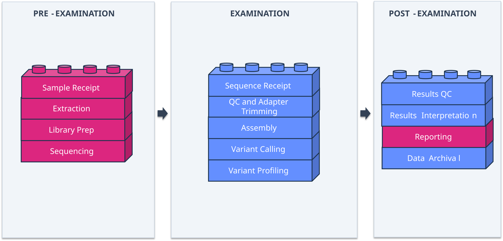

===============================================
Sample Journey
===============================================

Before designing internal audits for bioinformatics processes, it might be useful to map out the **sample journey**: the path a sample takes from initial input to final output. Mapping the sample journey means thinking about how your own bioinformatics processes work, which then becomes the scaffolding for identifying risks and gaps in these processes. From here, you can choose suitable :doc:`audit types <audit_introduction>`, and then create your :doc:`audit schedule <schedule>` and :doc:`checklist(s) <checklist>`.

If you already audit wet laboratory processes, you may be familiar with the sample journey as the ISO 15189 **pre-examination**, **examination**, and **post-examination** framework (Fig. 1, below).

.. figure:: ../images/e2e_sample_journey.svg
   :alt: Sample Journey Diagram
   :align: center
   :height: 300px

   Overview of the sample journey, i.e. the pre-examination, examination, and post-examination stages, from request to report.

That framework describes the whole examination process as a sample journey, from request to report. In **bioinformatics**, however, your scope and responsibility within that examination process may only cover **part of it** (Fig. 2, below), because the responsibility for other stages in the sample journey may lie with another team, or there may be shared responsibility between different teams. 

.. figure:: ../images/bioinformatics_sample_journey.svg
   :alt: Bioinformatics Sample Journey Diagram
   :align: center
   :height: 300px

   Example of a bioinformatics sample journey, showing the scope of bioinformatics processes and how they may fit into the overall examination process.

.. card:: 💡 advISO Tips
   :class-card: sd-border-success sd-shadow-md
   :class-header: sd-bg-success sd-text-white sd-font-weight-bold

   When evaluating your sample journey against Fig. 2, consider:

   1. Where does your bioinformatics team's scope and responsibility begin and end within the examination process?
   2. Within that specific bioinformatics scope, where are the risks? How and why could the process fail or not yield expected results?
   3. What are the clinical, operational, or reporting impacts of those risks?
   4. Are those risks actively mitigated by your Quality Management System (QMS)?

Worked Example: Pathogen X
-------------------------------------------------------------

The following worked example describes a generic bioinformatics analysis pipeline for **Pathogen X**, tracing data flow from raw input to final report (Fig. 3). 

Here, a genomics laboratory receives a sequenced sample, performs initial quality control (QC), and executes a multi-step bioinformatics pipeline to generate an analytical report. This report is subsequently passed to a clinician for interpretation.

   Example of a bioinformatics sample journey for "Pathogen X" showing the nested scope of bioinformatics processes within the overall examination workflow.

In this example, the bioinformatics sample journey is nested within the examination and post-examination stages: the bioinformatics team manages the analysis pipeline, while the wet laboratory manages sample preparation and sequence generation. This division is illustrative—how responsibilities are divided will vary by institution.

Mapping a pipeline as a flowchart is only the first half. The second half is interrogating each stage to determine what dependencies exist, what could unexpectedly alter the output, and what impact those changes would have:

Use the interactive exercise below. Click or hover on some of the stages of Pathogen X to reveal the some questions the Pathogen X Bioinformatics team might ask of their pipeline:

.. container:: flip-card-container

   .. container:: flip-card

      .. container:: flip-card-inner

         .. container:: flip-card-front

            **QC &**
            **Adapter Trimming**

         .. container:: flip-card-back

            Are QC parameters explicitly configured and locked? Have they ever been adjusted manually?

   .. container:: flip-card

      .. container:: flip-card-inner

         .. container:: flip-card-front

            **Variant**
            **Profiling**

         .. container:: flip-card-back

            If an underlying reference database updated automatically tomorrow, would the output for the Pathogen X analysis pipeline change? Would anyone notice?

   .. container:: flip-card

      .. container:: flip-card-inner

         .. container:: flip-card-front

            **Entire Pathogen X Pipeline**

         .. container:: flip-card-back

            Could you establish precisely which release of Pathogen X ran on a sample processed six months ago? Would you be able to reanalyse the sample?

   .. container:: flip-card

      .. container:: flip-card-inner

         .. container:: flip-card-front

            **Sequence Receipt**

         .. container:: flip-card-back

            If a stage of the Pathogen X pipeline that is usually performed automatically suddenly had to be performed manually, and an SOP was missing for this step, and a new team member executed it differently, would the variance be caught? Would it have a detrimental impact on the final result?

   .. container:: flip-card

      .. container:: flip-card-inner

         .. container:: flip-card-front

            **Assembly**

         .. container:: flip-card-back

            If a third-party tool dependency updated unexpectedly at the Assembly stage, does it alter downstream results?

None of these questions have a single static answer. Instead, they represent a method for reading your own sample journey: examining not just where data flows, but what it depends on at every step and how those dependencies could drift over time.

Grouping these risks
-------------------------------------------------------------
 
Read across the questions above, the risks for the Pathogen X pipeline fall into a handful of categories:
 
- **Documentation** 
   Is there a written record of how a pipeline or workflow should be performed, and was it followed? 
- **Pipeline validation**
   Was this pipeline shown to produce biologically meaningful results before it was ever used on a real sample?
- **Personnel**
   Would a new team member know how to troubleshoot a pipeline?
- **Pipeline functioning**
   Did this specific run actually execute and produce the outputs it was supposed to?
- **Software**
   Which version of each tool produced a given result, and would an unannounced update change it?
- **Databases**
   Which version of a reference database was used, and would it change without anyone noticing?
- **Hardware (equipment)**
   Is the compute this pipeline depends on reliable, and what happens if it is not?
- **Quality assurance**
   Are QC parameters fixed and reviewed, or open to manual adjustment?
 
These categories are not arbitrary — they are the same ones used to structure :doc:`the audit schedule <schedule>` and :doc:`the checklist(s) <checklist>` later in this guide.

Ultimately, it is important to document what you do.
-------------------------------------------------------------
Mapping the Sample Journey for Case Studies
-------------------------------------------------------------

Use the categories below as templates to continue mapping sample journeys, dependencies, and risks across your own infrastructure:

.. dropdown:: 🧪 Laboratory Procedure

   Map the journey from initial sample receipt through to wet-lab processing. Focus on identifying hand-off risks at the boundaries between laboratory personnel and bioinformatics ingestion points.

.. dropdown:: 🧬 Bioinformatics Quality Control (QC)

   Map QC evaluation steps from raw sequence input to pipeline commitment. Focus on defining metrics (e.g., Q-scores, coverage thresholds, read trimming) and evaluating what happens when a sample falls in a grey area.

.. dropdown:: 🧬 Bioinformatics Analysis Pipelines

   Map core pipelines (e.g., assembly, variant calling, annotation, phylogenetics). Identify high-consequence processes—such as pipelines directly informing clinical decision-making—which may require more stringent or frequent auditing than research pipelines.

.. dropdown:: 🌌 Galaxy / Automated Workflows

   Map automated workflow engines from data import through tool execution and reporting. Focus on tool versioning, step dependencies, and parameter locking across workflow runs.

.. dropdown:: 💻 Code Maintenance & Review Procedures

   Map code update, peer-review, and deployment procedures. Evaluate risks tied to repository access, testing protocols, version tagging, and production deployment boundaries.

.. dropdown:: 🔧 Systems, Infrastructure & Databases

   Map physical and cloud infrastructure supporting the analysis. Evaluate risks related to database versioning, reference file integrity, compute environment stability, backups, and security permissions.

----------------

Next Steps & Audit Planning
-------------------------------------------------------------

Mapping your sample journey clarifies where your risks lie. From here, jump directly to the topic that addresses your current gap:

.. grid:: 1 2 3 3
   :gutter: 3

   .. grid-item-card:: 🗓️ Audit Schedule
      :class-card: sd-shadow-sm sd-border-primary

      Establish audit frequency, scope rotation, and timelines based on your risk profile.
      
      +++
      :doc:`Go to Audit Schedule <schedule>`

   .. grid-item-card:: 📋 Audit Checklists
      :class-card: sd-shadow-sm sd-border-primary

      Build or adapt checklist questions targeted at specific pipeline stages or hand-offs.
      
      +++
      :doc:`Go to Checklists <checklist>`

   .. grid-item-card:: 🔍 Select Audit Types
      :class-card: sd-shadow-sm sd-border-primary

      Determine whether a vertical, horizontal, or process audit fits your team's current setup.
      
      +++
      :doc:`Explore Audit Types <audit_introduction>`

.. raw:: html

   