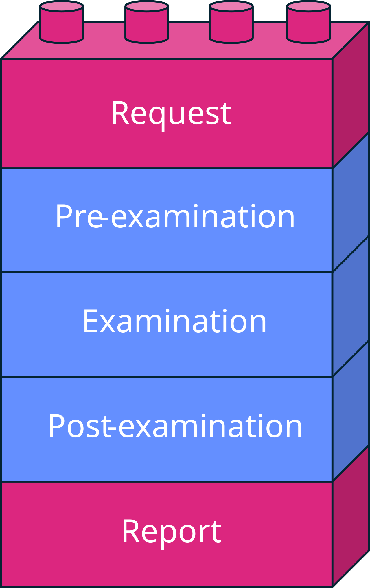
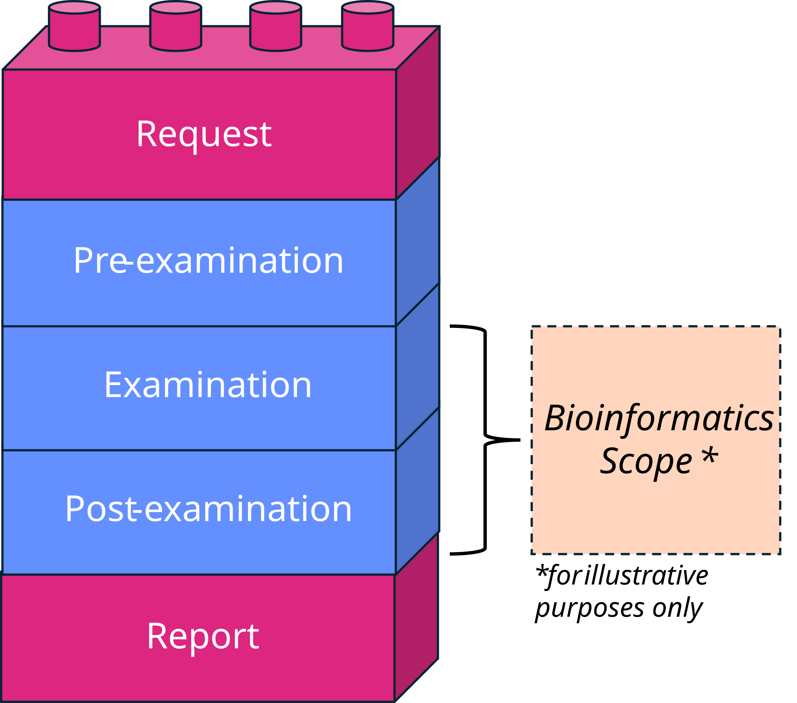
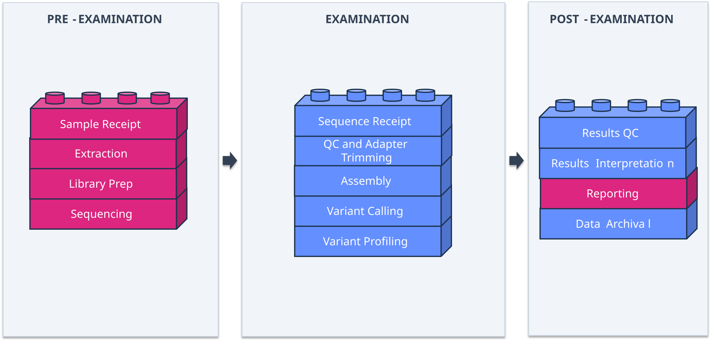

===============================================
Sample Journey
===============================================

Before designing internal audits for bioinformatics processes, it might be useful to map out the **sample journey**: the path a sample takes from initial input to final output. Mapping the sample journey means thinking about how your own bioinformatics processes work, which then becomes the scaffolding for identifying risks and gaps in these processes. From here, you can choose suitable :doc:`audit types </audit_guide/choosing_audit_type>`, and then create your :doc:`audit schedule <schedule>` and :doc:`checklist(s) <checklist>`.

If you already audit wet laboratory processes, you may be familiar with the sample journey as the ISO 15189 **pre-examination**, **examination**, and **post-examination** framework (Fig. 1, below). This framework describes the whole examination process as a sample journey, from request to report.

   Overview of the sample journey, i.e. the pre-examination, examination, and post-examination stages, from request to report.

In **bioinformatics**, however, your scope and responsibility within that examination process may only cover **part of it** (Fig. 2, below), because the responsibility for other stages in the sample journey may lie with another team, or there may be shared responsibility between different teams. 

   Example of a bioinformatics sample journey, showing the scope of bioinformatics processes and how they may fit into the overall examination process.

.. card:: 💡 When evaluating your sample journey against Fig. 2, consider:
   :class-card: sd-border-success sd-shadow-md
   :class-header: sd-bg-success sd-text-white sd-font-weight-bold

   1. Where does your bioinformatics team's scope and responsibility begin and end within the examination process?
   2. Within that specific bioinformatics scope, where are the risks? How and why could the process fail or not yield expected results?
   3. What are the clinical, operational, or reporting impacts of those risks?
   4. Are those risks actively mitigated by your Quality Management System (QMS)?

.. note::
   If you already have a Risk Register or have otherwise conducted a risk assessment for your bioinformatcis scope, this can feed into the sample journey mapping

Worked Example: Pathogen X
-------------------------------------------------------------

The following worked example describes a generic bioinformatics analysis pipeline for **Pathogen X**, tracing data flow from raw input to final report (Fig. 3, below). 

.. note::
   This Pathogen X sample journey can be roughly applied to both of the bioinformatics case studies.

.. dropdown:: 🧬 Bioinformatics Analysis Pipeline

   In this example, the bioinformatics analysis for Pathogen X is done with a pipeline, written in-house, and is controlled with a series of Nextflow modules. It is launched automatically on a compute cluster. 

.. dropdown:: 🌌 Galaxy Workflows

   In this example, the bioinformatics analysis for Pathogen X is done with a web-based workflow, which is built, executed, and managed in Galaxy. It is launched manually on a laptop. 

Here, a bioinformatics team receives a sequenced sample from a wet laboratory team, performs initial quality control (QC), and executes a multi-step bioinformatics pipeline to generate an analytical report. This result is interpreted, then the report is signed off by the wet laboratory team, and is subsequently passed to a clinician, who will then use the genomic data to inform a decision concerning a patient (Fig 3, below)

   Example of a bioinformatics sample journey for "Pathogen X" showing the nested scope of bioinformatics processes within the overall examination workflow.

In this example, the bioinformatics sample journey is nested within the examination and post-examination stages (illustrated in Fig. 3, above), i.e. the bioinformatics team manages the bioinformatics method, while a wet laboratory manages sample preparation and sequence generation. 

.. note:: This division of responsibilities is merely illustrative; how responsibilities are divided will vary by institution.

Once the bioinformatics scope is mapped, it is then advisable to interrogate each stage of the bioinformatics method to determine what could unexpectedly alter the final output of the sample, and what downstream impact that could have. **It is important to question what you do not have as as well as what you do have**.

Consider the interactive exercise below. Click or hover on some of the stages of the Pathogen X bioinformatics analysis to reveal some of the questions the Pathogen X Bioinformatics team might ask of their analysis. In each case, consider the impact.

.. container:: flip-card-container

   .. container:: flip-card

      .. container:: flip-card-inner

         .. container:: flip-card-front

            **Sequence Receipt**

         .. container:: flip-card-back

            Would a new team member know how to competently troubleshoot if the sequence transfer from the wet laboratory failed or otherwise outputted corrupt FASTQs?

   .. container:: flip-card

      .. container:: flip-card-inner

         .. container:: flip-card-front

            **Assembly**

         .. container:: flip-card-back

            If the tool that runs the genome assembly is memory-intensive, can the compute run this efficiently and reliably without crashing?

   .. container:: flip-card

      .. container:: flip-card-inner

         .. container:: flip-card-front

            **Variant Calling**

         .. container:: flip-card-back

            Which version of a variant-calling tool was used to analyse the Pathogen X sample, and if this is not controlled, would the final result be changed meaningfully?

   .. container:: flip-card

      .. container:: flip-card-inner

         .. container:: flip-card-front

            **Results QC**

         .. container:: flip-card-back

            Are the thresholds used to determine the quality of a consensus sequence documented anywhere?

   .. container:: flip-card

      .. container:: flip-card-inner

         .. container:: flip-card-front

            **Data Storage and Archival**

         .. container:: flip-card-back

            If a stakeholder (e.g. epidemiologist, clinician) identified a discrepancy in a report for a Pathogen X sample, could the bioinformatics files be traced back to find the source of a potential bug?

Of course, there are many more questions that could be asked about this bioinformatics workflow, and indeed, none of these questions have a single static answer. They often raise wider questions about the impact. This interrogation represents a method for reading your own sample journey, examining not just where and how data flows, but what it depends on at every stage, and how dependencies could drift over time. 

The sample journey ultimately serves as a record for documenting what steps you have taken to show how risk is mitigated. 

Next Steps & Audit Planning
-------------------------------------------------------------

Mapping your sample journey clarifies where your risks lie. From here, jump directly to the topic that addresses your current gap:

.. grid:: 1 2 3 3
   :gutter: 3

   .. grid-item-card:: 🗓️ Audit Schedule
      :class-card: sd-shadow-sm sd-border-primary

      Establish audit frequency, scope rotation, and timelines based on your risk profile.
      
      +++
      :doc:`Go to Audit Schedule <schedule>`

   .. grid-item-card:: 📋 Audit Checklists
      :class-card: sd-shadow-sm sd-border-primary

      Build or adapt checklist questions targeted at specific pipeline stages or hand-offs.
      
      +++
      :doc:`Go to Checklists <checklist>`

   .. grid-item-card:: 🔍 Choose Audit Types
      :class-card: sd-shadow-sm sd-border-primary

      Determine whether a vertical, horizontal, or process audit fits your team's current setup.
      
      +++
      :doc:`Explore Audit Types </audit_guide/choosing_audit_type>`

.. raw:: html

   