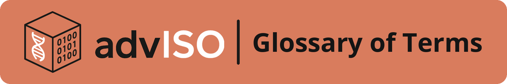

Welcome to the AdvISO Audit Guide
=================================

**Release:** |release| [|today|]

..  attention::

   This guide is still under development. Please check back for updates, and feel free to provide feedback or suggestions by submitting an issue to the `GitHub repository <https://github.com/advISO-project/advISO_audit_guide/issues>`_.

This guide is intended to support bioinformatics teams in diagnostic laboratories to design, implement, and maintain internal audits for `ISO 15189 accreditation <https://www.iso.org/standard/76677.html>`_ It is designed to be modular and adaptable to the specific needs of bioinformatics procedures and teams, wherever they are in their accreditation journey.

Through practical :ref:`case studies <case_studies>` and worked examples, this guide applies the internal audit process directly to bioinformatics processes. Some readers will already be familiar with this internal audit process from accrediting wet laboratory processes.

---------------------------------------------------------------------------------------

Glossary of ISO terms
------------------------------

As part of this guide, a glossary of ISO terms is provided, offering definitions and bioinformatics-specific translations to facilitate clear communication and shared understanding between wet lab and dry lab teams. It is intended to bridge disciplinary language gaps and promote collaboration across different areas of expertise.

---------------------------------------------------------------------------------------

Other guides in this series
-----------------------------

This guide forms part of the advISO series of practical how-to resources for laboratories working toward ISO accreditation:

.. grid:: 3
   :gutter: 3

   .. grid-item::

      .. image:: _static/sop_guide_button.png
         :target: https://adviso-sop-guide.readthedocs.io/en/latest/
         :alt: advISO SOP Guide
         :class: guide-button

   .. grid-item::

      .. image:: _static/competency_guide_button.png
         :target: https://adviso-competency-guide.readthedocs.io/en/latest/
         :alt: advISO Competency Guide
         :class: guide-button

   .. grid-item::

      .. image:: _static/validation_guide_button.png
         :target: https://adviso-validation-guide.readthedocs.io/en/latest/
         :alt: advISO Validation Guide
         :class: guide-button

---------------------------------------------------------------------------------------

Project partners
-----------------

This guide has been produced as part of the Wellcome Trust-funded project: *ISO in a Box: Developing a framework to enable the development of end-to-end genomics-based ISO 15189 and ISO 17025 accredited services, anywhere in the world* (Grant Reference: 228162/Z/23/Z). The project is led by Cardiff University, in collaboration with Public Health Wales, Wellcome Sanger Institute, South African National Bioinformatics Institute, and University of the Western Cape.

Find out more about the `advISO Bioinformatics accreditation in a box project <https://www.cardiff.ac.uk/adviso-bioinformatics-accreditation>`_.

.. figure:: _static/partner_logos.png
        :align: center
        :width: 650px

.. toctree::
   :maxdepth: 2
   :hidden:

   audit_guide/case_studies
   audit_guide/audit_introduction
   audit_guide/choosing_audit_type
   audit_guide/sample_journey
   audit_guide/schedule
   audit_guide/checklist
   audit_guide/performing_audits
   audit_guide/findings
   audit_guide/review
   audit_guide/glossary
   